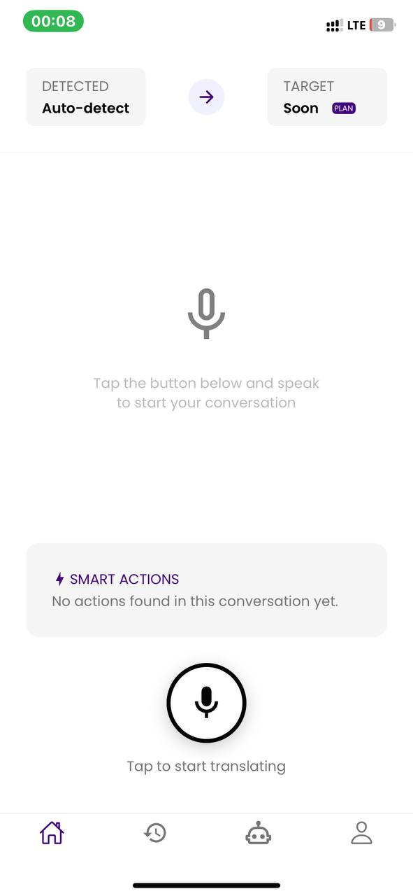

# Talki 🗣️

Talki is a high-performance AI personal language assistant specifically designed for immigrants. It goes beyond simple translation to provide a comprehensive communication toolkit, helping users navigate new environments with confidence.

## Visual Preview

<p align="center">
  
  
  
</p>

## Key Features

-   **High-Performance Translation**: Instant, accurate translation to break language barriers in real-time.
-   **Conversation Transcription**: Automatically transcribes your conversations, ensuring you never miss a detail from important meetings or appointments.
-   **Smart Actions**: AI-powered extraction of "Smart Actions" (deadlines, appointments, reminders) directly from your transcribed interactions.
-   **Immigrant-Centric Design**: Tailored to the unique needs of individuals navigating new languages and cultures.

## Getting Started

### Prerequisites

- [Node.js](https://nodejs.org/) (LTS version recommended)
- [Expo Go](https://expo.dev/go) app on your mobile device (to run on physical hardware)

### Installation

1. Clone the repository:
   ```bash
   git clone <repository-url>
   cd Talki
   ```

2. Install dependencies:
   ```bash
   npm install
   ```

3. Configure Environment Variables:
   Create a `.env` file in the root directory and add your Supabase credentials:
   ```env
   EXPO_PUBLIC_SUPABASE_URL=your_supabase_url
   EXPO_PUBLIC_SUPABASE_ANON_KEY=your_supabase_anon_key
   ```

4. Start the development server:
   ```bash
   npx expo start
   ```

## Infrastructure & Security

### Tech Stack

- **Framework**: [Expo](https://expo.dev/) (React Native)
- **Routing**: [Expo Router](https://docs.expo.dev/router/introduction/)
- **Backend/Database**: [Supabase](https://supabase.com/)
- **AI Engine (STT)**: OpenAI Whisper (via Supabase Edge Functions)
- **AI Intelligence**: OpenAI GPT-4o-mini (via Supabase Edge Functions)
- **Styling**: [Shopify Restyle](https://github.com/Shopify/restyle)
- **Animation**: [Lottie](https://lottiereactnative.dev/) & [React Native Reanimated](https://docs.swmansion.com/react-native-reanimated/)

### Security

To ensure maximum security and protect project credentials, all AI processing (Speech-to-Text and Translation) is handled server-side via **Supabase Edge Functions**. 
- No provider API keys (OpenAI, etc.) are stored or exposed on the client side.
- Communication between the app and AI models is encrypted and proxied through our secure backend.

## Project Setup

Talki uses **Supabase** for its backend infrastructure. To get started:

1. Create a new project at [Supabase](https://supabase.com/).
2. Obtain your `Project URL` and `Anon Key` from the API settings.
3. Add them to your `.env` file as shown in the installation steps.

### Usage

Once the development server is running, you can:
- Scan the QR code with **Expo Go** (Android) or the **Camera app** (iOS) to run the app on your physical device.
- Press `a` for Android Emulator.
- Press `i` for iOS Simulator.
- Press `w` for the Web version.

## Learn More

To learn more about the tools used in this project:
- [Expo Documentation](https://docs.expo.dev/)
- [Supabase Documentation](https://supabase.com/docs)
- [OpenAI API Reference](https://platform.openai.com/docs/api-reference)

---
Created by [Agyei Michael Addai (Michantech)](https://www.linkedin.com/in/michael-addai-agyei)
